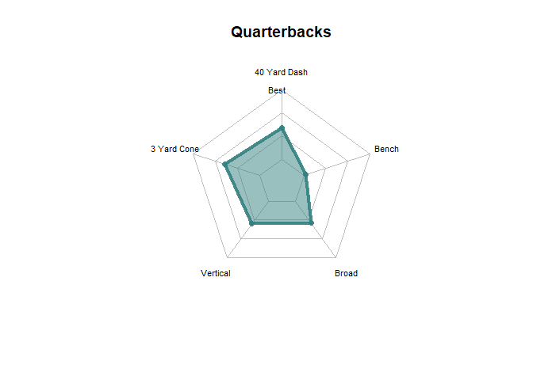
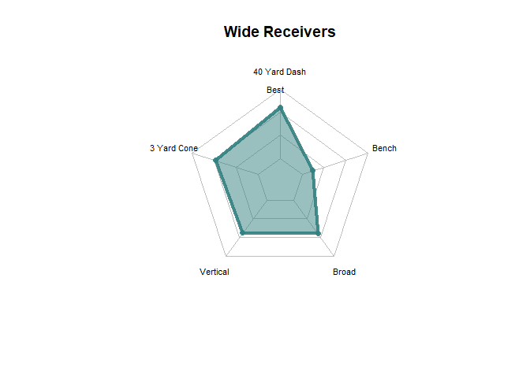
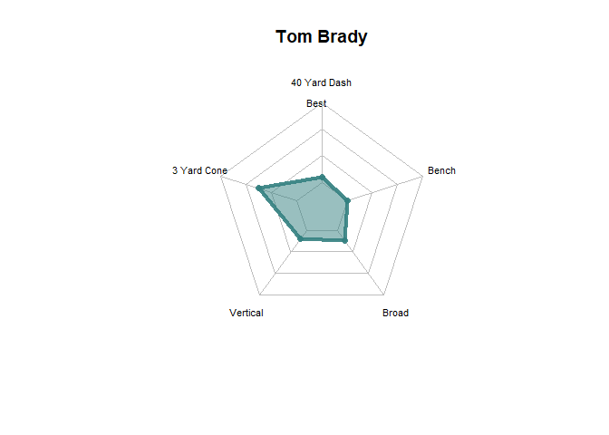
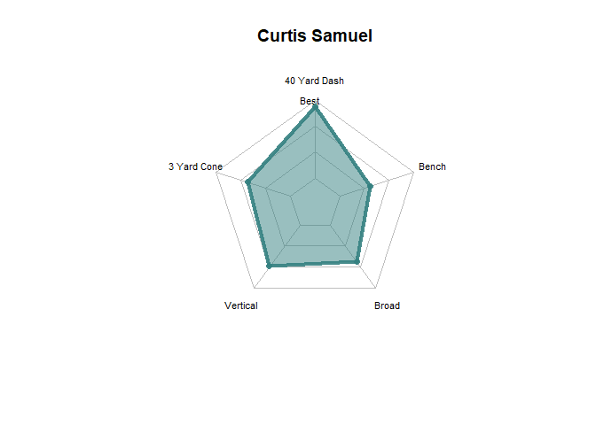

Example Visualization
================
Tomas Okal

# Data

I was able to find a file that has historical NFL combine data from the
80s to 2018. Using this data, I was able to scale every player that is
in the dataset by the worst and best performances for the 40 yard dash,
3 yard cone drill, Vertical jump, Broad jump, and Bench press.

The goal is then to any player that we want against this scale to see
how good they were at the combine.

For fantasy football, we can use this same approach but find a series of
4 to 6 metrics that we find to be important for each position and rate
each player as the season progresses to the best and worst performances
by that same position class. For example, in the upcoming 2020 season
when it is 3 games in, how well is Julio Jones or Mike Williams doing
against these metrics.

We could also apply this same methodology to NFL offenses in general.
Drive success rate, Turnovers, Punt rate, Pass rate, etc. could all be
mapped like this to get a gauge on how well offenses are doing as the
season progresses when compared to historical trends.

Here is a sample of this data showing the first 5 and last five rows
(players) for this dataset. As seen, we have the name, year, and
position of each player along with this new metric for the 40 yard dash
and other combine drills. The closer a number is to 100, the better it
is as it is closer to the best performance in that drill. The closer it
is to 0, the worse it is. Players who did not perform in a drill are
given a value of 0.

    ##                    name year position forty_perc three_cone_perc vertical_perc
    ##    1:      Kyle Allamon 2000       TE  31.034483        43.87097      31.91489
    ##    2:     Anthony Becht 2000       TE  50.862069        66.45161      51.06383
    ##    3:         Tom Brady 2000       QB   6.034483        49.67742      12.76596
    ##    4:     Demario Brown 2000       RB  54.310345        51.61290      40.42553
    ##    5:       Keith Brown 2000       RB  59.482759        85.80645      36.17021
    ##   ---                                                                         
    ## 1243:     Taywan Taylor 2017       WR  75.000000        90.32258      51.06383
    ## 1244:      Trent Taylor 2017       WR  63.793103        79.35484      48.93617
    ## 1245: Mitchell Trubisky 2017       QB  60.344828        70.96774      25.53191
    ## 1246:    Deshaun Watson 2017       QB  61.206897        65.80645      46.80851
    ## 1247:        Davis Webb 2017       QB  50.000000        67.74194      48.93617

## Radar Chart

I now use this data to create the radar charts. The package I used to
create this is a bit problematic so I will find an alternative way to do
this later. But we can pick a position and see how good that position
does in relation to the overall performances.

Below is how well Quarterbacks do in comparison to other positions.

<!-- -->

And how well Wide Receivers do.

<!-- -->

However we can pick out players by name and year from this such as Tom
Brady from 2000.

<!-- -->

Or Curtis Samuel from 2017.

<!-- -->
